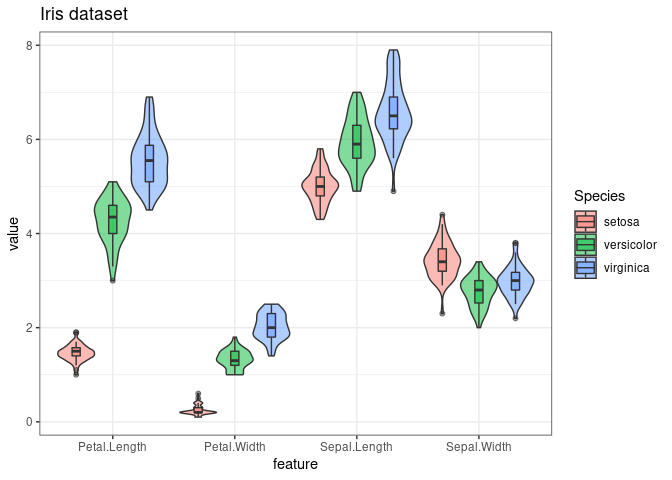
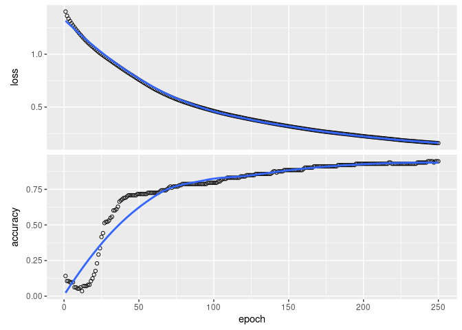
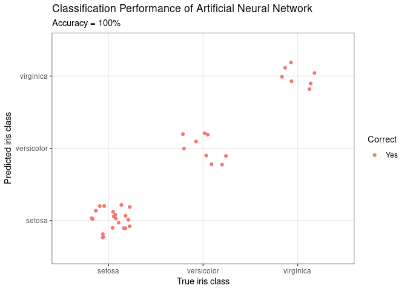

tensorflow tutorials
================
Miguel A. García-Campos

# Description of tutorial

This notebook presents machine-learning examples using tensorflow/keras
as infrastructure to create and train neural networks. **It is required
that** **tensorflow is correctly installed before running the
examples**, for this, follow this
[link](https://tensorflow.rstudio.com/installation/), and follow the
instructions, also copied bellow.

# Tensor Flow installation

First, install the tensorflow R package from GitHub as follows:

``` r
install.packages("tensorflow")
```

Then, use the install\_tensorflow() function to install TensorFlow. Note
that on Windows you need a working installation of Anaconda.

``` r
library(tensorflow)
install_tensorflow()
```

You can confirm that the installation succeeded with:

``` r
library(tensorflow)
tf$constant("Hellow Tensorflow")
#> tf.Tensor(b'Hellow Tensorflow', shape=(), dtype=string)
```

This will provide you with a default installation of TensorFlow suitable
for use with the tensorflow R package. Read on if you want to learn
about additional installation options, including installing a version of
TensorFlow that takes advantage of NVidia GPUs if you have the correct
CUDA libraries installed

# Setup: Packages and functions

We will load the packages:

  - parallel
  - keras
  - tidyverse

<!-- end list -->

``` r
tStart <- Sys.time()
installLoad_CRAN <- function(package){
    if (!require(package, character.only = T)) {
        install.packages(package, dependencies = TRUE, 
                         repos = "http://cran.us.r-project.org")
        library(package, character.only = T, quietly = T)
    }
}
CRAN_packs <- c("parallel", "keras", "tidyverse")
invisible(sapply(CRAN_packs, installLoad_CRAN))
```

# Categorical Classification from continuous variables - Iris dataset

This example is published by **leonjessen** in his github repo
[keras\_tensorflow\_on\_iris](https://github.com/leonjessen/keras_tensorflow_on_iris)

-----

**Building a simple neural network using Keras and Tensorflow**

A minimal example for building your first simple artificial neural
network using [Keras and TensorFlow for
R](https://tensorflow.rstudio.com/keras/) - Right, let’s get to it\!

## Data

[The famous Iris flower data
set](https://en.wikipedia.org/wiki/Iris_flower_data_set) contains data
to quantify the morphologic variation of Iris flowers of three related
species. In other words - A total of 150 observations of 4 input
features `Sepal.Length`, `Sepal.Width`, `Petal.Length` and `Petal.Width`
and 3 output classes `setosa` `versicolor` and `virginica`, with 50
observations in each class. The distributions of the feature values
looks like so:

``` r
iris %>% as_tibble %>% gather(feature, value, -Species) %>%
  ggplot(aes(x = feature, y = value, fill = Species)) +
  geom_violin(alpha = 0.5, scale = "width", position = position_dodge(width = 0.9)) +
  geom_boxplot(alpha = 0.5, width = 0.2, position = position_dodge(width = 0.9)) +
  theme_bw() + ggtitle("Iris dataset")
```

<!-- -->

## Aim

Our aim is to connect the 4 input features (`Sepal.Length`,
`Sepal.Width`, `Petal.Length` and `Petal.Width`) to the correct output
class (`setosa` `versicolor` and `virginica`) using an artificial neural
network. For this task, we have chosen the following simple architecture
with one input layer with 4 neurons (one for each feature), one hidden
layer with 4 neurons and one output layer with 3 neurons (one for each
class), all fully connected:

Our artificial neural network will have a total of 35 parameters: 4 for
each input neuron connected to the hidden layer, plus an additional 4
for the associated first bias neuron and 3 for each of the hidden
neurons connected to the output layer, plus an additional 3 for the
associated second bias neuron. I.e. (4 x 4)+ 4 + (4 x 3) + 3 = 35

## Prepare data

We start with slightly wrangling the iris data set by renaming and
scaling the features and converting character labels to numeric:

``` r
nn_dat = iris %>% as_tibble %>%
  mutate(sepal_l_feat = scale(Sepal.Length),
         sepal_w_feat = scale(Sepal.Width),
         petal_l_feat = scale(Petal.Length),
         petal_w_feat = scale(Petal.Width),          
         class_num    = as.numeric(Species) - 1, # factor, so = 0, 1, 2
         class_label  = Species) %>%
  select(contains("feat"), class_num, class_label)
nn_dat %>% head(3)
```

    ## # A tibble: 3 x 6
    ##   sepal_l_feat[,1] sepal_w_feat[,1] petal_l_feat[,1] petal_w_feat[,1] class_num
    ##              <dbl>            <dbl>            <dbl>            <dbl>     <dbl>
    ## 1           -0.898            1.02             -1.34            -1.31         0
    ## 2           -1.14            -0.132            -1.34            -1.31         0
    ## 3           -1.38             0.327            -1.39            -1.31         0
    ## # … with 1 more variable: class_label <fct>

Then, we split the iris data into a training and a test data set,
setting aside 20% of the data for left out data partition, to be used
for final performance evaluation:

``` r
set.seed(2021)
test_f = 0.20
nn_dat = nn_dat %>%
  mutate(partition = sample(c('train','test'), nrow(.), replace = TRUE, 
                            prob = c(1 - test_f, test_f)))
```

Based on the partition, we can now create training and test data

``` r
x_train = nn_dat %>% filter(partition == 'train') %>% select(contains("feat")) %>% as.matrix
y_train = nn_dat %>% filter(partition == 'train') %>% pull(class_num) %>% to_categorical(3)
x_test  = nn_dat %>% filter(partition == 'test')  %>% select(contains("feat")) %>% as.matrix
y_test  = nn_dat %>% filter(partition == 'test')  %>% pull(class_num) %>% to_categorical(3)
```

## Set Architecture

With the data in place, we now set the architecture of our artificical
neural network:

``` r
model <- keras_model_sequential()
model %>% 
  layer_dense(units = 4, activation = 'relu', input_shape = 4) %>% 
  layer_dense(units = 3, activation = 'softmax')
model %>% summary
```

    ## Model: "sequential"
    ## ________________________________________________________________________________
    ## Layer (type)                        Output Shape                    Param #     
    ## ================================================================================
    ## dense_1 (Dense)                     (None, 4)                       20          
    ## ________________________________________________________________________________
    ## dense (Dense)                       (None, 3)                       15          
    ## ================================================================================
    ## Total params: 35
    ## Trainable params: 35
    ## Non-trainable params: 0
    ## ________________________________________________________________________________

As expected we see 35 trainable parameters. Next, the architecture set
in the model needs to be compiled:

``` r
model %>% compile(
  loss      = 'categorical_crossentropy',
  optimizer = optimizer_rmsprop(),
  metrics   = c('accuracy')
)
```

## Train the Artificial Neural Network

Lastly we fit the model and save the training progress in the `history`
object:

``` r
history <- fit(model,
               x = x_train, y = y_train,
               epochs           = 200,
               batch_size       = 20,
               validation_split = 0,
               verbose = F)
plot(history)
```

<!-- -->

## Evaluate Network Performance

The final performance can be obtained like so:

``` r
perf = model %>% evaluate(x_test, y_test)
print(perf)
```

    ##      loss  accuracy 
    ## 0.1091032 0.9729730

Then we can augment the `nn_dat` for plotting:

``` r
plot_dat = nn_dat %>% filter(partition == 'test') %>%
  mutate(class_num = factor(class_num),
         y_pred    = factor(predict_classes(model, x_test)),
         Correct   = factor(ifelse(class_num == y_pred, "Yes", "No")))
plot_dat %>% select(-contains("feat")) %>% head(3)
```

    ## # A tibble: 3 x 5
    ##   class_num class_label partition y_pred Correct
    ##   <fct>     <fct>       <chr>     <fct>  <fct>  
    ## 1 0         setosa      test      0      Yes    
    ## 2 0         setosa      test      0      Yes    
    ## 3 0         setosa      test      0      Yes

and lastly, we can visualize the confusion matrix like so:

``` r
title     = "Classification Performance of Artificial Neural Network"
sub_title = str_c("Accuracy = ", round(perf["accuracy"], 3) * 100, "%")
x_lab     = "True iris class"
y_lab     = "Predicted iris class"
ggplot(plot_dat, aes(x = class_num, y = y_pred, colour = Correct)) +
  geom_jitter(height = 0.25, width = 0.25) +
  scale_x_discrete(labels = levels(nn_dat$class_label)) +
  scale_y_discrete(labels = levels(nn_dat$class_label)) +
  theme_bw() +
  labs(title = title, subtitle = sub_title, x = x_lab, y = y_lab)
```

<!-- -->

## Conclusion

Here, we created a 3-class predictor with an accuracy of 100% on a left
out data partition. I hope this little post illustrated how you can get
started building artificial neural network using [Keras and TensorFlow
in R](https://keras.rstudio.com/). This was a basic minimal example. It
should be noted that the network can be expanded to create full deep
Learning networks and furthermore, the entire TensorFlow API is
available. It also goes to show how important it is for a data
scientist, that the tools needed to go efficiently from idea to
implementation is available - Available and accessible technology is the
cornerstone of modern data science.

# Image Classifier - Hand-written numbers

This first example is from Rstudio tensorflow’s package presentation
[site](https://tensorflow.rstudio.com/tutorials/beginners/)

Let’s start by loading and preparing the MNIST dataset. The values of
thee pixels are integers between 0 and 255 and we will convert them to
floats between 0 and 1.

``` r
mnist <- dataset_mnist()
mnist$train$x <- mnist$train$x/255
mnist$test$x <- mnist$test$x/255
```

Now, let’s define the a Keras model using the sequential API.

``` r
model <- keras_model_sequential() %>% 
  layer_flatten(input_shape = c(28, 28)) %>% 
  layer_dense(units = 128, activation = "relu") %>% 
  layer_dropout(0.2) %>% 
  layer_dense(10, activation = "softmax")
```

**Note** that when using the Sequential API the first layer must specify
the input\_shape argument which represents the dimensions of the input.
In our case, images 28x28.

After defining the model, you can see information about layers, number
of parameters, etc with the summary function:

``` r
summary(model)
```

    ## Model: "sequential_1"
    ## ________________________________________________________________________________
    ## Layer (type)                        Output Shape                    Param #     
    ## ================================================================================
    ## flatten (Flatten)                   (None, 784)                     0           
    ## ________________________________________________________________________________
    ## dense_3 (Dense)                     (None, 128)                     100480      
    ## ________________________________________________________________________________
    ## dropout (Dropout)                   (None, 128)                     0           
    ## ________________________________________________________________________________
    ## dense_2 (Dense)                     (None, 10)                      1290        
    ## ================================================================================
    ## Total params: 101,770
    ## Trainable params: 101,770
    ## Non-trainable params: 0
    ## ________________________________________________________________________________

The next step after building the model is to compile it. It’s at compile
time that we define what loss will be optimized and what optimizer will
be used. You can also specify metrics, callbacks and etc that are meant
to be run during the model fitting.

Compiling is done with the compile function:

``` r
model %>% 
  compile(
    loss = "sparse_categorical_crossentropy",
    optimizer = "adam",
    metrics = "accuracy"
  )
```

Note that compile and fit (which we are going to see next) modify the
model object in place, unlike most R functions.

Now let’s fit our model:

``` r
model %>% 
  fit(
    x = mnist$train$x, y = mnist$train$y,
    epochs = 5,
    validation_split = 0.3,
    verbose = 2
  )
```

We can now make predictions with our model using the predict function:

``` r
predictions <- predict(model, mnist$test$x)
head(predictions, 2)
```

    ##              [,1]         [,2]         [,3]         [,4]         [,5]
    ## [1,] 2.041668e-07 6.738689e-09 1.486532e-05 1.072958e-04 4.552772e-11
    ## [2,] 2.035350e-08 8.403591e-05 9.998393e-01 7.130532e-05 5.287355e-13
    ##              [,6]         [,7]         [,8]         [,9]        [,10]
    ## [1,] 9.679722e-08 4.789386e-13 9.998690e-01 4.999659e-08 8.565845e-06
    ## [2,] 8.086838e-08 4.036538e-07 2.312884e-10 4.896200e-06 5.992758e-11

By default predict will return the output of the last Keras layer. In
our case this is the probability for each class. You can also use
predict\_classes and predict\_proba to generate class and probability -
these functions are slightly different then predict since they will be
run in batches.

You can access the model performance on a different dataset using the
evaluate function, for example:

``` r
model %>% 
  evaluate(mnist$test$x, mnist$test$y, verbose = 0)
```

    ##       loss   accuracy 
    ## 0.08755279 0.97420001

Our model achieved \~90% accuracy on the test set.

Unlike models built with the lm function, to save Keras models for later
prediction, you need to use specialized functions, like save\_model\_tf:

``` r
save_model_tf(object = model, filepath = "model")
```

You can then reload the model and make predictions with:

``` r
reloaded_model <- load_model_tf("model")
all.equal(predict(model, mnist$test$x), predict(reloaded_model, mnist$test$x))
```

    ## [1] TRUE

# Notebook info

## Warnings

``` r
warnings()
```

## Session Info

``` r
sessionInfo()
```

    ## R version 4.0.0 (2020-04-24)
    ## Platform: x86_64-pc-linux-gnu (64-bit)
    ## Running under: CentOS Linux 7 (Core)
    ## 
    ## Matrix products: default
    ## BLAS/LAPACK: /home/labs/schwartzlab/miguelg/.local/share/r-miniconda/envs/r-reticulate/lib/libopenblasp-r0.3.10.so
    ## 
    ## locale:
    ##  [1] LC_CTYPE=en_US.UTF-8       LC_NUMERIC=C              
    ##  [3] LC_TIME=en_US.UTF-8        LC_COLLATE=en_US.UTF-8    
    ##  [5] LC_MONETARY=en_US.UTF-8    LC_MESSAGES=en_US.UTF-8   
    ##  [7] LC_PAPER=en_US.UTF-8       LC_NAME=C                 
    ##  [9] LC_ADDRESS=C               LC_TELEPHONE=C            
    ## [11] LC_MEASUREMENT=en_US.UTF-8 LC_IDENTIFICATION=C       
    ## 
    ## attached base packages:
    ## [1] parallel  stats     graphics  grDevices utils     datasets  methods  
    ## [8] base     
    ## 
    ## other attached packages:
    ##  [1] forcats_0.5.0   stringr_1.4.0   dplyr_1.0.2     purrr_0.3.4    
    ##  [5] readr_1.4.0     tidyr_1.1.2     tibble_3.0.4    ggplot2_3.3.2  
    ##  [9] tidyverse_1.3.0 keras_2.3.0.0  
    ## 
    ## loaded via a namespace (and not attached):
    ##  [1] Rcpp_1.0.5        lubridate_1.7.9.2 lattice_0.20-41   assertthat_0.2.1 
    ##  [5] zeallot_0.1.0     digest_0.6.27     utf8_1.1.4        R6_2.5.0         
    ##  [9] cellranger_1.1.0  backports_1.1.10  reprex_0.3.0      evaluate_0.14    
    ## [13] httr_1.4.2        pillar_1.4.6      tfruns_1.4        rlang_0.4.8      
    ## [17] readxl_1.3.1      rstudioapi_0.13   whisker_0.4       Matrix_1.2-18    
    ## [21] reticulate_1.18   rmarkdown_2.5     splines_4.0.0     labeling_0.4.2   
    ## [25] munsell_0.5.0     broom_0.7.2       compiler_4.0.0    modelr_0.1.8     
    ## [29] xfun_0.19         pkgconfig_2.0.3   base64enc_0.1-3   mgcv_1.8-33      
    ## [33] tensorflow_2.2.0  htmltools_0.5.0   tidyselect_1.1.0  fansi_0.4.1      
    ## [37] crayon_1.3.4      dbplyr_2.0.0      withr_2.3.0       rappdirs_0.3.1   
    ## [41] grid_4.0.0        nlme_3.1-150      jsonlite_1.7.1    gtable_0.3.0     
    ## [45] lifecycle_0.2.0   DBI_1.1.0         magrittr_2.0.1    scales_1.1.1     
    ## [49] cli_2.1.0         stringi_1.5.3     farver_2.0.3      fs_1.5.0         
    ## [53] xml2_1.3.2        ellipsis_0.3.1    generics_0.1.0    vctrs_0.3.4      
    ## [57] tools_4.0.0       glue_1.4.2        hms_0.5.3         yaml_2.2.1       
    ## [61] colorspace_2.0-0  rvest_0.3.6       knitr_1.30        haven_2.3.1

## Time to knit

``` r
tEnd <- Sys.time()
tDif <- tEnd - tStart
cat("Time to knit notebook:", round(tDif, 2), units(tDif))
```

    ## Time to knit notebook: 27.46 secs
