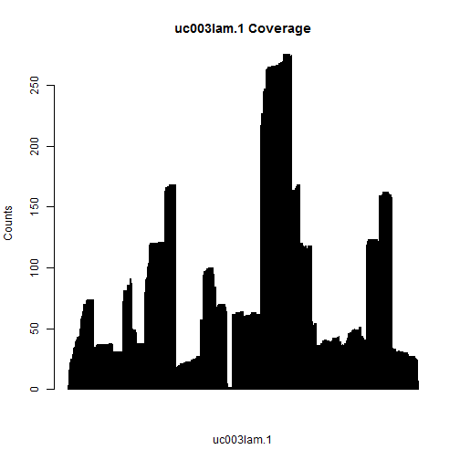
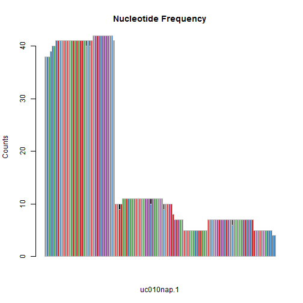

Group Meeting April
==========================
author: Miguel Angel Garcia Campos
date: April 27th, 2020
width: 1980
height: 1200
autosize: true

# Outline:

## 1) txtools. A package and an abridged demo.
### 2) ???

========================================================
# txtools

**txtools** is an R package designed to analyze RNA-seq data having in mind the
general common metrics needed to work with different RNA modifications in a 
transcriptomic-aware framework.

**txtools** is meant to expand the functionality of the
[**GenomicRanges**](https://bioconductor.org/packages/release/bioc/html/GenomicRanges.html)
package, as currently it does not support transcriptomic-wise features. 

**txtools** processes GenomicAlignments objects into their transcriptomic 
versions. And enables further manipulation and analysis of common metrics as
coverage, read-starts, read-ends, nucleotide pile-up.

--- 

# Installation

txtools has a [Github repository](https://github.com/AngelCampos/txtools), from
which it can be found the instructions to be installed.

You can install the development version from GitHub with:


```r
if (!requireNamespace("BiocManager", quietly = TRUE))
    install.packages("BiocManager")

BiocManager::install("AngelCampos/txtools")
```


========================================================
# Demo

## From genomic to transcriptomic

### Loading the data

- The main input that we want to process are *GenomicAlignments* from **BAM files**, 
into their transcriptomic homologues. To do this *txtools* requires gene models
provided in the form of **BED-12 or BED-6 files**. 

- In this basic example we use data provided within **txtools**.

- We first load the BAM file and the gene model's BED file using the 
`tx_load_bam()` and `tx_load_bed()` functions.

---


```r
library(txtools)

bamFile <- system.file("extdata", "example_hg19.bam", package = "txtools")
bedFile <- system.file("extdata", "twoUCSCgenes_hg19.bed", package = "txtools")

# Loading reads and gene annotation
reads <- tx_load_bam(bamFile, loadSeq = T, verbose = F, yieldSize = 10000)
geneAnnot <- tx_load_bed(bedFile) # plyranges read_bed function
```

========================

- For converting our loaded genomic `reads` to **transcriptomic reads** we use the
`tx_reads()` function. 
    - **This function will assign mappings to their corresponding genes ONLY if 
    they are consistent with the exon structure of the gene model.**

- Currently, txtools is designed for and requires RNA-seq libraries that are 
**strand-specific**.
    - **To accelerate processing the multi-core function** `tx_reads_mc()` 
    **is available for UNIX systems**

---


```r
txReads <- tx_reads(reads, geneAnnot, withSeq = T, verbose = T)
```

```
Processing 2530 reads, using 2 gene models 
2509 paired-end reads overlap 2 gene models 
Filtering reads by gene model... 
Processing sequences. This may take several minutes... 
Output contains: 1676 unique reads in 2 gene models 
```

```r
summary(txReads)
```

```
[1] "GRangesList object of length 2 with 0 metadata columns"
```

===============
## Compatibility with GenomicRanges

- Now `txReads` contains a list with all paired-end RNA-seq mappings divided by 
their corresponding gene models, along with their sequences as specified in the 
call to `tx_reads()`.

- The resulting object is a GenomicRangesList (*GRangesList*) a list that contains 
*GenomicRanges* the core object of their homonymous package, but their 
coordinates belong now to the transcriptomic references used. 

- In this way we can take advantage of **GenomicRanges** functions and accesors 
to retrieve information from the mappings, and manipulate them.

--- 

For example:

* The start of reads


```r
GenomicRanges::start(txReads)
```

```
IntegerList of length 2
[["uc003lam.1"]] 1813 1784 1784 1781 1781 1781 1781 1781 ... 8 8 7 8 8 4 3 1
[["uc010nap.1"]] 70 70 70 70 70 39 39 39 43 39 39 39 ... 1 1 1 1 1 1 1 1 1 1 1
```

* Extracting meta columns, with additional data, using the mcols() function. 
In this case, we extract the values for the 6th mapping of the 'uc010nap.1'
gene.

```r
GenomicRanges::mcols(txReads$uc010nap.1)[6,]
```

```
[1] "ACAAGGATGGAAGAGGCCCTCGGGCCTGACAACACGC.............ATTGCCACCTACTTCGTGGCATCTAACCATCGTTTTT"
```

=====
# Beyond *GenomicAlignments*

Although using **GenomicRanges** functions may be useful in some cases,
txtools contains several functions that allow further 
processing and manipulation of the resulting transcriptomic mappings that are
not available otherwise.

### Raw Gene Counts

A common task in RNA-seq analysis workflows is simply counting the reads (or
mappings) that fall into a gene model to calculate gene expression levels. We 
can easily calculate that for all the genes using the `tx_counts()` function.


```r
tx_counts(txReads)
```

```
.
uc003lam.1 uc010nap.1 
      1622         54 
```

---

### Filtering

To control for spurious mappings we can filter for too long mappings, now in the
transcriptomic space, with the `tx_filter_max_width()` function. In this example
we set the threshold to 500, removing mappings longer than 500 nucleotides at 
the transcript level.


```r
txReads <- tx_filter_max_width(txReads, 300) # Filter out transcripts longer than 300 bases

tx_counts(txReads)
```

```
.
uc003lam.1 uc010nap.1 
      1602         54 
```

==========
# Summarizing reads into data.tables (DT)

A useful representation of RNA-seq information we came up with is to summarise 
read metrics into tables spanning the whole transcript with information per 
nucleotide. Currently the metrics that we extract  are the following:

* Coverage
* Starts or 5'-ends counts
* Ends or 3'-ends counts
* Nucleotide frequencies
* Deletion frequencies

txtools provides three main functions to calculate all or parts of this 
information:

* `tx_coverageDT()`: Calculates only coverage, read-starts counts, and read-ends
counts. And doesn't require sequence information.

---


```r
resTab1 <- tx_coverageDT(txReads, geneAnnot)
resTab1[[1]][1:5, 1:5]
```

```
    chr   gencoor strand       gene txcoor
1: chr5 134734928      - uc003lam.1      1
2: chr5 134734927      - uc003lam.1      2
3: chr5 134734926      - uc003lam.1      3
4: chr5 134734925      - uc003lam.1      4
5: chr5 134734924      - uc003lam.1      5
```

```r
resTab1[[1]][1:5, 6:8]
```

```
   cov start_5p end_3p
1:   1        1      0
2:   1        0      0
3:   2        1      0
4:   3        1      0
5:   3        0      0
```

- The resulting object is of class **data.table**. A fast and memory efficient 
relative to the data.frame object.

==========================================================================
* **`tx_nucFreqDT()`**: Calculates nucleotide frequency pileup. Requires 
sequence information to be loaded.


```r
resTab2 <- tx_nucFreqDT(txReads, geneAnnot)
resTab2[[1]][1:5,1:5]
```

```
    chr   gencoor strand       gene txcoor
1: chr5 134734928      - uc003lam.1      1
2: chr5 134734927      - uc003lam.1      2
3: chr5 134734926      - uc003lam.1      3
4: chr5 134734925      - uc003lam.1      4
5: chr5 134734924      - uc003lam.1      5
```

```r
resTab2[[1]][1:5,6:12]
```

```
   A C G T N - .
1: 1 0 0 0 0 0 0
2: 0 1 0 0 0 0 0
3: 0 0 0 2 0 0 0
4: 0 0 3 0 0 0 0
5: 0 0 3 0 0 0 0
```

---

* **`tx_covNucFreqDT()`**: Calculates all previous metrics in one data.table 
(coverage, read-starts counts, and read-ends counts, and nucleotide frequency).


```r
resTab3 <- tx_covNucFreqDT(txReads, geneAnnot)
resTab3[[1]][1:5,1:5]
```

```
    chr   gencoor strand       gene txcoor
1: chr5 134734928      - uc003lam.1      1
2: chr5 134734927      - uc003lam.1      2
3: chr5 134734926      - uc003lam.1      3
4: chr5 134734925      - uc003lam.1      4
5: chr5 134734924      - uc003lam.1      5
```

```r
resTab3[[1]][1:5,6:15]
```

```
   cov start_5p end_3p A C G T N - .
1:   1        1      0 1 0 0 0 0 0 0
2:   1        0      0 0 1 0 0 0 0 0
3:   2        1      0 0 0 0 2 0 0 0
4:   3        1      0 0 0 3 0 0 0 0
5:   3        0      0 0 0 3 0 0 0 0
```

========================
# DT functionality

- **data.tables (DT)** enable easy and fast access to data, ready for 
manipulation and analysis, for example, creating a barplot with the coverage 
column.


```r
iGene <- "uc003lam.1"
barplot(resTab3[[iGene]]$cov, main = paste(iGene, "Coverage"),
        ylab = "Counts", xlab = iGene)
```



---

* Or a Nucleotide frequency barplot


```r
iGene <- "uc010nap.1"
barplot(t(data.frame(resTab3[[iGene]][,c("A", "T", "G", "C", "N")])),
        col = c("#E41A1C", "#377EB8", "#4DAF4A", "#984EA3", "black"), border = "gray",
        main = paste("Nucleotide Frequency"), ylab = "Counts", xlab = iGene)
```



================
# Adding the reference sequence to the DT

- When working with transcriptomic data one would like to easily get the 
relevant sequence. To add this info to a DT simply use the `tx_add_refSeqDT()` 
function.

- Preparation: To use the `tx_add_refSeqDT()` function we need a reference genome.
In this case we use a BSgenome, a collection of pre-packaged genomes for 
easy installation. In this case we will use the BSgenome for human 
"BSgenome.Hsapiens.UCSC.hg19".


```r
# BiocManager::install("BSgenome.Hsapiens.UCSC.hg19") # Uncomment if you need to install
# Loading reference genome
genome <- BSgenome.Hsapiens.UCSC.hg19::BSgenome.Hsapiens.UCSC.hg19
# Adding the reference sequence to the summarized DT object
newDT <- tx_add_refSeqDT(resTab1$uc003lam.1, genome, geneAnnot)
newDT[1:5]
```

```
    chr   gencoor strand       gene txcoor refSeq cov start_5p end_3p
1: chr5 134734928      - uc003lam.1      1      A   1        1      0
2: chr5 134734927      - uc003lam.1      2      C   1        0      0
3: chr5 134734926      - uc003lam.1      3      T   2        1      0
4: chr5 134734925      - uc003lam.1      4      G   3        1      0
5: chr5 134734924      - uc003lam.1      5      G   3        0      0
```

=============
# Soon to come features:
- **How to use guide and practical cases**
- **Graphical representations functions**
    + Coverage 
    + Nucleotide frequency 
    + Gene model ideogram
- **Meta-gene analysis tools**
    + Meta-gene-wise metrics aggregation
    + Meta-gene data plots
